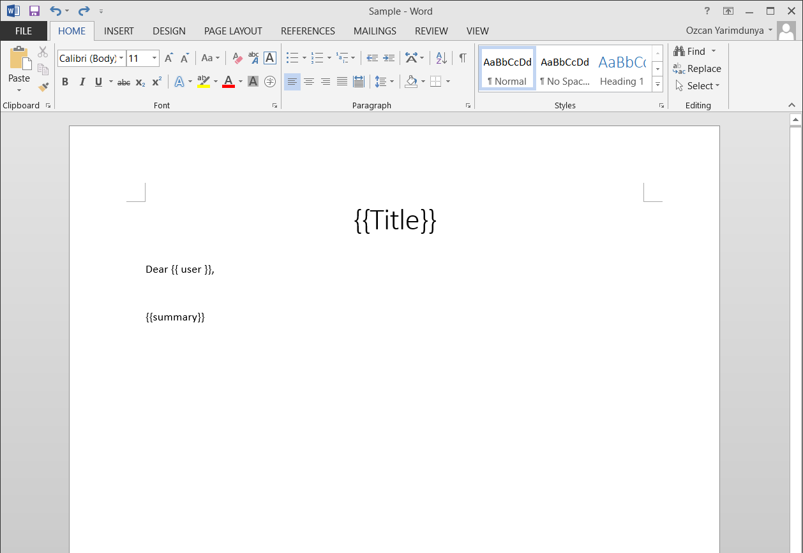
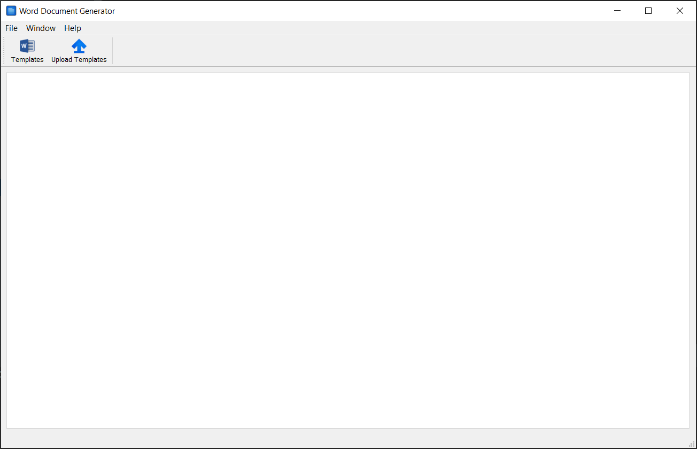
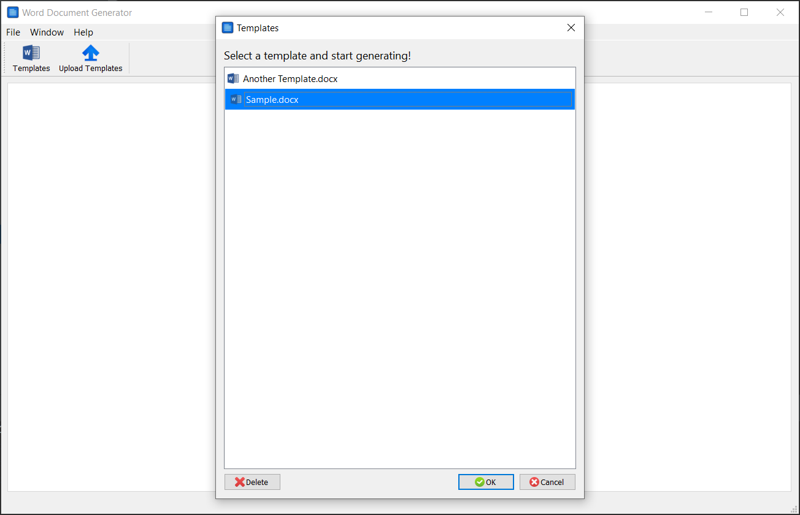
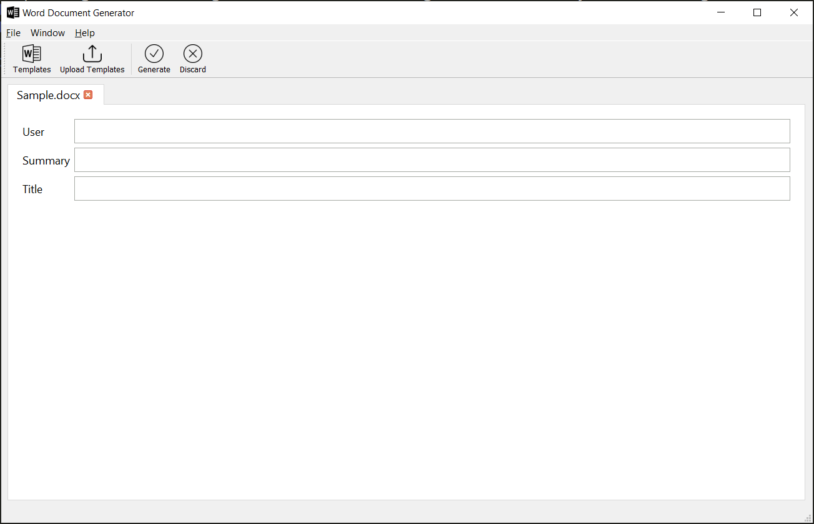
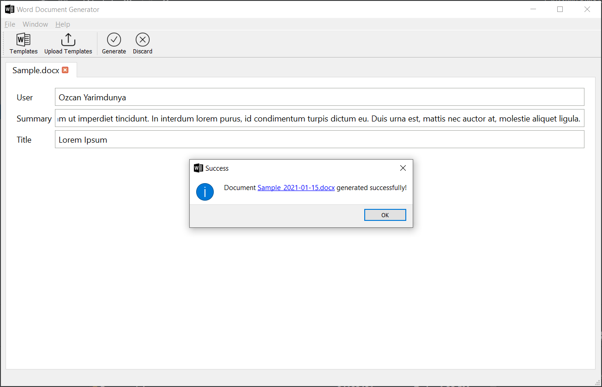
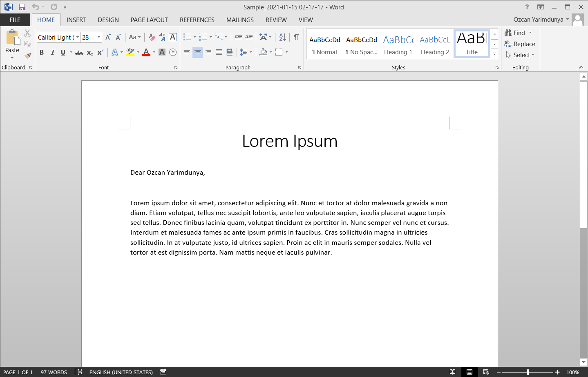

# Word document generator

This application intend to generate word documents from the template by using jinja syntax.

Things to do respectively;

- Create a template by using `{{ fieldname }}` syntax in the template where you want to text be dynamic.
- Take the demo as sample for the template word document.

## Download

Download application from this [LINK.](https://github.com/ozcanyarimdunya/dg/releases/download/1.0.1/Word.Document.Generator.exe)

## Screenshots

- Create a word document as template.
  

- Open application, click **Upload Templates** and select template you have generated.
  

- Click **Templates** button, select template and click **Ok** button or double-click on template name.
  

- Dynamic fields will be rendered automatically.
  

- Fill the form, click **Ok** button and select path where you want generated file to be saved
  

- Check the generated document!
  

```text
Copyright 2021 Özcan YARIMDÜNYA

Permission is hereby granted, free of charge, to any person obtaining a copy of this software and associated documentation files (the "Software"), to deal in the Software without restriction, including without limitation the rights to use, copy, modify, merge, publish, distribute, sublicense, and/or sell copies of the Software, and to permit persons to whom the Software is furnished to do so, subject to the following conditions:

The above copyright notice and this permission notice shall be included in all copies or substantial portions of the Software.

THE SOFTWARE IS PROVIDED "AS IS", WITHOUT WARRANTY OF ANY KIND, EXPRESS OR IMPLIED, INCLUDING BUT NOT LIMITED TO THE WARRANTIES OF MERCHANTABILITY, FITNESS FOR A PARTICULAR PURPOSE AND NONINFRINGEMENT. IN NO EVENT SHALL THE AUTHORS OR COPYRIGHT HOLDERS BE LIABLE FOR ANY CLAIM, DAMAGES OR OTHER LIABILITY, WHETHER IN AN ACTION OF CONTRACT, TORT OR OTHERWISE, ARISING FROM, OUT OF OR IN CONNECTION WITH THE SOFTWARE OR THE USE OR OTHER DEALINGS IN THE SOFTWARE.
```